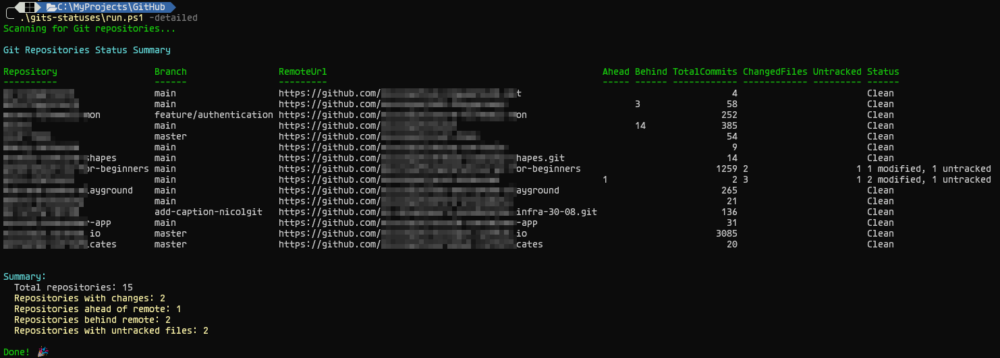

# Welcome to gits-statuses
In this repo you can find a PowerShell script that once executed into the root directory where you have all your local repos
gives you a table in output that shows repo URL, push number, pull number, change number, untracked changes, in a similar way oh-my-posh provides on the
prompt, but here you have a massive view of all your repos.

# How to use it

Clone the repo in the same folder you have all your repos

```
git clone https://github.com/nicolgit/gits-statuses  
```

Then type:

```
# Basic usage - scan current directory
.\gits-statuses\run.ps1

# Detailed view with full remote URLs
.\gits-statuses\run.ps1 -Detailed

# Scan a specific directory
.\gits-statuses\run.ps1 -Path "C:\MyProjects"

# Show help
.\gits-statuses\run.ps1 -Help
```

# Samples
Simple output


Detailed output

